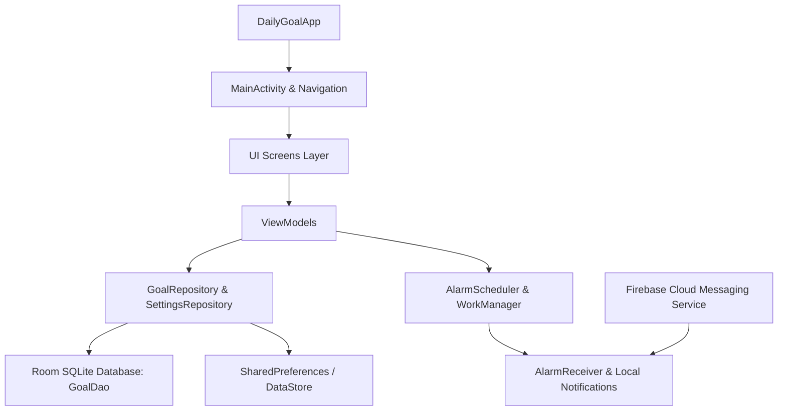

# Project Summary — Aimly: Daily Goals & Habits

## 1. Overview
**Aimly — Daily Goals & Habits** is a modern, privacy-focused, offline-first Android application designed to help users build meaningful daily routines, track habits, monitor productivity streaks, and maintain personal reflections. Built entirely with modern Kotlin, Jetpack Compose, Material 3, and Room SQLite, Aimly combines spring physics animations with robust local background reminder scheduling and Firebase Cloud Messaging (FCM).

---

## 2. Technical Stack & Key Dependencies

| Layer / Subsystem | Technologies & Libraries Used |
| :--- | :--- |
| **Language & Runtime** | Kotlin 2.0+, Java 17/21 JBR |
| **UI Framework** | Jetpack Compose (BOM 2024.09.00), Material 3, Extended Icons |
| **Architecture Pattern** | MVVM (Model-View-ViewModel) + Clean Data Layer |
| **Local Database** | Room SQLite 2.6.1 with KSP code generator |
| **Background Tasks** | AndroidX WorkManager 2.9.1 & `AlarmManager` |
| **Cloud Messaging** | Firebase Cloud Messaging (FCM) & Firebase Analytics |
| **Navigation** | Jetpack Navigation Compose 2.8.1 |
| **Target Android SDK** | **API Level 36** (Android 16), Minimum SDK 26 (Android 8.0) |
| **Version Code / Name** | `versionCode = 5`, `versionName = "1.1.0"` |
| **Signing Certificate** | Signed with Production Keystore (`aimly-release-key.jks`) |

---

## 3. Core Architectural Modules

### 1. UI & Experience Layer (`com.dailygoal.reminder.ui`)
- **`SplashScreen.kt`**: Animated app startup with logo scaling and fade-in effect.
- **`OnboardingScreen.kt`**: First-time user onboarding carousel introducing goal setting, daily streaks, and smart notifications.
- **`HomeScreen.kt`**: Central dashboard featuring:
  - Daily Reflection & Mood Journal card ([`DailyReflectionCard.kt`](file:///c:/ll/simple-app/app/src/main/java/com/dailygoal/reminder/ui/components/DailyReflectionCard.kt)).
  - Real-time search bar for goal lookup.
  - Horizontal category filter chips row ([`CategoryChip.kt`](file:///c:/ll/simple-app/app/src/main/java/com/dailygoal/reminder/ui/components/CategoryChip.kt)).
  - Animated goal cards with spring scale physics and quick increment buttons ([`GoalCard.kt`](file:///c:/ll/simple-app/app/src/main/java/com/dailygoal/reminder/ui/components/GoalCard.kt)).
- **`AddEditGoalScreen.kt`**: Goal creation/editing interface with custom time pickers, frequency selection (Daily, Weekly, Specific Days), reminder toggle, and category selection.
- **`GoalDetailScreen.kt`**: Individual goal view showing history, completion percentage, reminder times, and streak stats.
- **`StatisticsScreen.kt`**: Comprehensive analytics hub with completion charts, 7-day consistency grid, and Milestone Badges (`⚡ 7-Day Streak`, `🏆 100 Goals`, `🛡️ Streak Shield`, `👑 Master Focus`).
- **`HistoryScreen.kt`**: Timeline log of all completed and archived goals over time.
- **`SettingsScreen.kt` & `NotificationSettingsScreen.kt`**: Dark mode toggles, sound/vibration preferences, backup controls, FCM topic subscriptions, and Privacy Policy links.

### 2. Data & Persistence Layer (`com.dailygoal.reminder.data`)
- **`GoalEntity` / `GoalDao`**: Local Room database entity storing goal titles, descriptions, targets, current progress, frequencies, category tags, streak counters, creation dates, and reminder timestamps.
- **`GoalRepository`**: Repository abstraction mediating data access between ViewModel instances and the Room database.

### 3. Notification & Reminder Subsystem (`com.dailygoal.reminder.notification`)
- **`AlarmScheduler`**: Precision alarm scheduling using `AlarmManager.setExactAndAllowWhileIdle()` to trigger offline reminders even in Doze Mode.
- **`AlarmReceiver`**: BroadcastReceiver triggered by scheduled alarms to push high-priority local notification banners.
- **`FCMService`**: Firebase Messaging receiver handling remote push notifications and topic messaging (`/topics/daily_reminders`).
- **`BootReceiver`**: Automatically reschedules all active goal alarms upon device reboot.

---

## 4. Key UI/UX Highlights in v1.1.0

- 🎨 **Spring Physics Animations**: Smooth spring scaling on task completion using `Spring.DampingRatioMediumBouncy`.
- 🔥 **Pulsing Streak Badges**: Infinite pulse scale effect for goals with streaks of 7+ days along with 🛡️ Streak Shield indicators.
- 🧘 **Daily Reflection Card**: Record mood (`🚀 Super Focus`, `😊 Good Pace`, `☕ Steady`, `🔋 Low Battery`) directly from the Home screen.
- 🔍 **Real-Time Instant Search**: Live filtering across titles and categories.
- 🌈 **Category Color Systems**: Tailored HSL color themes for Health, Productivity, Study, Personal, Fitness, and Work.

---

## 5. Artifacts & Release Deliverables

| Artifact | File Location | Status |
| :--- | :--- | :--- |
| **Android App Bundle (.aab)** | [`app/build/outputs/bundle/release/app-release.aab`](file:///c:/ll/simple-app/app/build/outputs/bundle/release/app-release.aab) | **Built & Production Signed** |
| **Debug APK (.apk)** | `app/build/outputs/apk/debug/app-debug.apk` | Verified |
| **App Icon (512x512)** | [`play_store_512.png`](file:///c:/ll/simple-app/play_store_512.png) | High-Res PNG Ready |
| **Feature Graphic (1024x500)** | [`play_store_feature_1024x500.png`](file:///c:/ll/simple-app/play_store_feature_1024x500.png) | High-Res PNG Ready |
| **Play Store Screenshots** | `screenshot_1_home.png` to `screenshot_4_notifications.png` | Play Store Format |
| **Privacy Policy Page** | [`privacy_policy.html`](file:///c:/ll/simple-app/privacy_policy.html) & [`PRIVACY_POLICY.md`](file:///c:/ll/simple-app/PRIVACY_POLICY.md) | Formatted & Ready |
| **Store Listing Metadata** | [`STORE_LISTING.md`](file:///c:/ll/simple-app/STORE_LISTING.md) | Includes Title, Short & Full Descriptions |
